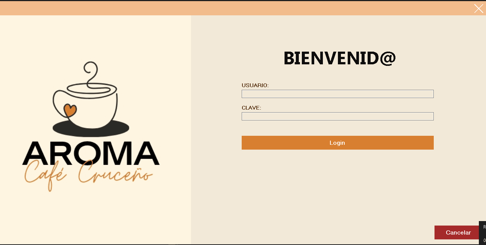
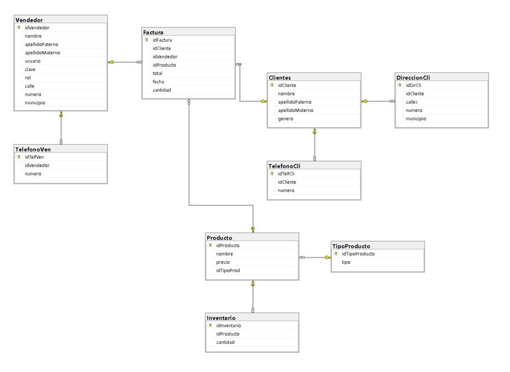
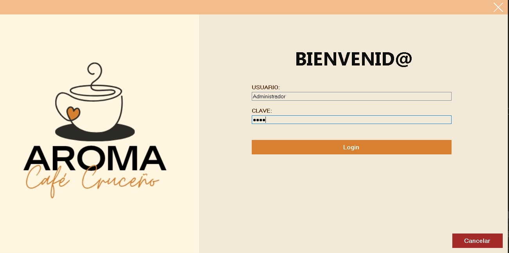
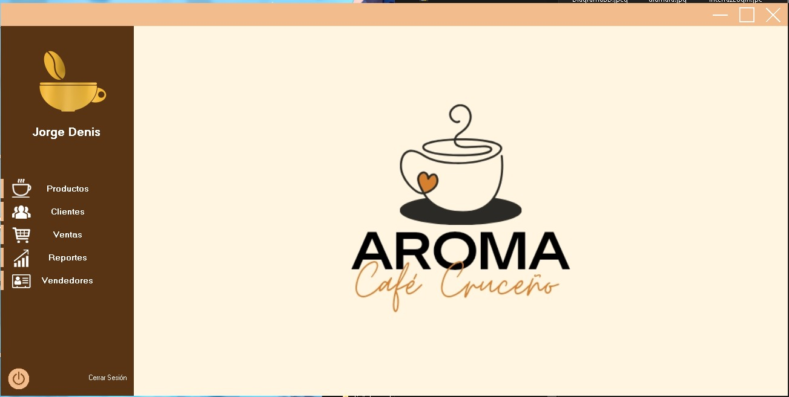
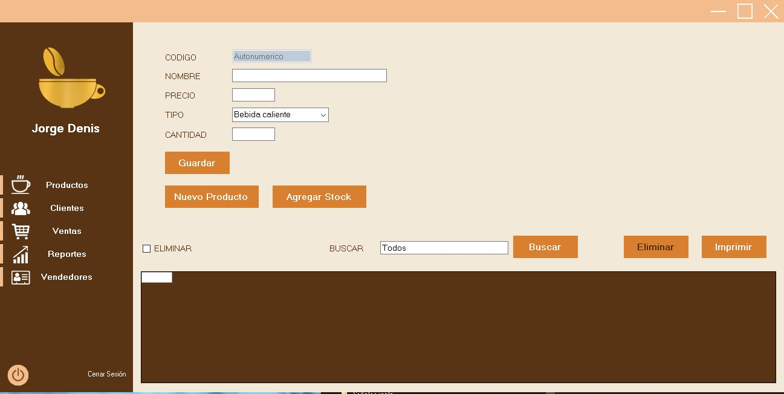

# Proyecto AROMA CAFE CRUCEÑO - Sistema de Información 1

¡Bienvenido al repositorio del proyecto "AROMA CAFE CRUCEÑO - Sistema de Información 1" 

## Descripción
Este repositorio contiene el código y la documentación relacionados con el sistema de gestión de ventas y usuarios para la cafetería "Aroma Café Cruceño", ubicada en Santa Cruz de la Sierra, Bolivia. El objetivo de este proyecto es mejorar la eficiencia en la administración de ventas y usuarios en la cafetería, optimizando los procesos y proporcionando una mejor experiencia tanto para el personal como para los clientes.

## Integrantes del Equipo
- Diamara Jakeline Muñoz Vargas
- Lider Moreno Padilla
- Nihurcka Arias Pestaña
- Jorge Denis Barba Barrios

## Roles en el Proyecto
En el desarrollo de este proyecto, se asignaron los siguientes roles basados en el patrón Modelo-Vista-Controlador (MVC):

1. *Modelo: Diamara Jakeline Muñoz Vargas*  Equipo responsable de diseñar y gestionar la estructura de la base de datos para almacenar información de ventas, productos y usuarios.

2. *Vista: Lider Moreno Padilla* Equipo encargado de desarrollar la interfaz de usuario que permitirá a los usuarios de la cafetería interactuar con el sistema. Esto incluye la presentación de datos, formularios y visualización de informes.

3. *Controlador: Nihurcka Arias Pestaña y Jorge Denis Barba Barrios* Equipo que se encarga de implementar la lógica de negocio y las acciones que se deben llevar a cabo en respuesta a las interacciones de los usuarios. También gestiona la comunicación entre el modelo y la vista.

## Contenido del Avance
Si deseas agregar imágenes que muestren el avance del proyecto, sigue estos pasos:

1. Asegúrate de que las imágenes estén en formato adecuado, como PNG o JPG.

2. Agrega las imágenes en la carpeta "Images" en este repositorio.

3. Imagenes y videos de la Interfaz y Diagrma de la Base de Datos (Aroma Café Cruceño) :

   
   
   
   
    

## Contenido

- `Cronograma`: 
Para obtener detalles adicionales sobre nuestro cronograma puedes acceder al siguiente enlace <a href="https://www.notion.so/CRONOGRAMA-DE-ACTIVIDADES-27fad24f54e0443383566b42b20e713a?pvs=4">CRONOGRAMA.com</a>.

- `Ingresa a Nuestra Presentación:`: 
Ingresa al enlace para ver más detalles en nuestra presentación digital: <a href="https://www.canva.com/design/DAFreVsSkZc/nfjUfh-m8gsdt5X0wrAOAA/view?utm_content=DAFreVsSkZc&utm_campaign=designshare&utm_medium=link&utm_source=viewer">PRESENTACIÓN.com</a>.

## Contacto
¿Tienes preguntas, sugerencias o comentarios sobre el proyecto "CAFE CRUCEÑO"? No dudes en contactarnos:
- Lider Moreno Padilla:  
 Correo Electrónico: <a href="mailto:sc.lider.moreno.p@upds.net.bo">Hacer clic aquí para redactar un correo a Lider</a>

- Diamara Jakeline Muñoz Vargas:  
 Correo Electrónico: <a href="mailto:sc.diamara.munoz.v@upds.net.bo">Hacer clic aquí para redactar un correo a Diamara</a>

- Nihurcka Arias Pestaña:
 Correo Electrónico: <a href="mailto:sc.nihurcka.arias.p@upds.net.bo">Hacer clic aquí para redactar un correo a Nihurcka</a>

- Jorge Denis Barba Barrios:
Correo Electrónico: <a href="mailto:sc.jorge.barba.b@upds.net.bo">Hacer clic aquí para redactar un correo a Jorge</a>

## Notas
- Este proyecto es parte de un trabajo académico para la materia de Sistema de Información 1.

¡Gracias por tu interés en el proyecto "CAFE CRUCEÑO - Sistema de Información 1"!

 
